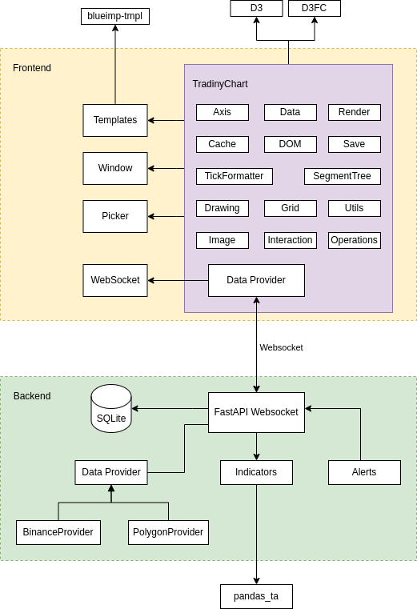

The architecture is divided into two main components: **Frontend** and **Backend**.

### Frontend

- **TradinyChart**: Manages various components: Axis, Data, Render, Cache, DOM, Save, TickFormatter, SegmentTree, Drawing, Grid, Utils, Image, Interaction, Operations.

- **Templates**: Manages layout structure.

- **Picker**: Allows users to pick color, grid, draw tools.

- **Data Provider**: Connects with the backend service to fetch data.

- **WebSocket**: Facilitates communication with the backend.

- **External Libraries**:

    - **D3**: Used for data visualization.
    - **D3FC**: Enhances D3 with financial charting.
    - **blueimp-tmpl**: Used for templating.

### Backend

- **FastAPI WebSocket**: Handles data flow and communication with the frontend.
- **SQLite**: Stores and manages data locally.
- **Data Provider**: Interfaces with external data services (e.g., BinanceProvider, PolygonProvider).
- **Indicators**: Process data and provide analytical insights.
    - **pandas_ta**: Performs technical analysis computations.
- **Alerts**: Sends notifications. Note, it connects to the WebSocket as a client to retrieve data for alert evaluation.
